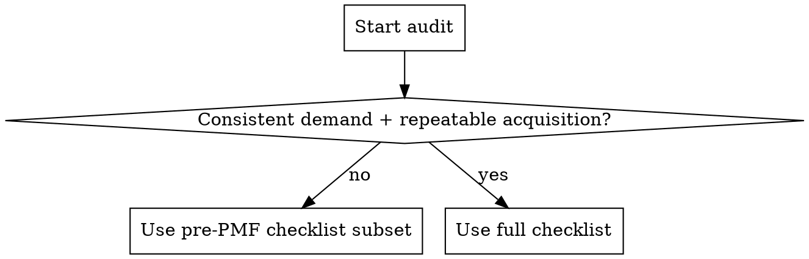

# Marketing Capability Audit

## Overview

Assess marketing readiness by mapping goals to funnel stages, scoring core capabilities, and producing a prioritized 30/60/90-day plan.

## Workflow Decision

Use a lighter checklist if pre-PMF or no consistent demand; use the full checklist if demand is consistent and growth is the goal.

## Audit Steps

1. Capture context
Collect: product type, ICP, price point, sales motion, geo, launch timeline, budget, current traction, team capacity, and constraints.

2. Map goals to funnel stages
Pick 1-2 primary goals (e.g., awareness, qualified leads, trials, activation, retention). Tie each goal to a funnel stage.

3. Score capabilities
Use the checklist in `references/marketing-checklist.md`. For each item, mark:
- `Ready`: implemented and working
- `Partial`: exists but incomplete or inconsistent
- `Missing`: not present
Include evidence and owner for each item.

4. Prioritize gaps
Rank gaps by impact and effort. Choose top 5 to address in the next 30 days.

5. Produce outputs
Deliver:
- Scoreboard (stage → readiness)
- Top 5 gaps with rationale
- 30/60/90 plan with owners
- Metrics to track (per goal)

## Quick Reference

Stage: Awareness
Key capabilities: Positioning, PR/media list, website clarity, basic SEO, social presence
Primary artifacts: Messaging doc, landing page, tracking baseline

Stage: Consideration
Key capabilities: Proof, case studies, email capture, comparison content
Primary artifacts: Lead magnet, nurture emails, proof assets

Stage: Conversion
Key capabilities: Pricing page, trial/onboarding, sales collateral
Primary artifacts: Pricing page, demo flow, objection handling

Stage: Retention/Referral
Key capabilities: Lifecycle email, activation tracking, referral loops
Primary artifacts: Activation checklist, retention metrics

## Example

Input:
- B2B SaaS, $99/mo, founder-led sales, US market
- Launch in 6 weeks, budget $2k/mo, no paid yet
- Some organic traffic, no email list

Output (summary):
- Goals: Awareness + qualified trials
- Top gaps (30 days):
  1. Messaging doc (Missing)
  2. Analytics baseline (Missing)
  3. Lead magnet + email capture (Missing)
  4. Trial onboarding email (Partial)
  5. Keyword-backed content plan (Missing)
- 30/60/90: launch landing page refresh, email capture, 4 SEO pages, set up analytics, start monthly newsletter

## Common Mistakes

- Treating every channel as required instead of matching to goals
- Running paid before messaging and analytics are stable
- Ignoring retention/activation metrics while focusing only on acquisition
- Building assets without a clear ICP and positioning

## Resources

- `references/marketing-checklist.md`: Current marketing capability checklist and notes
